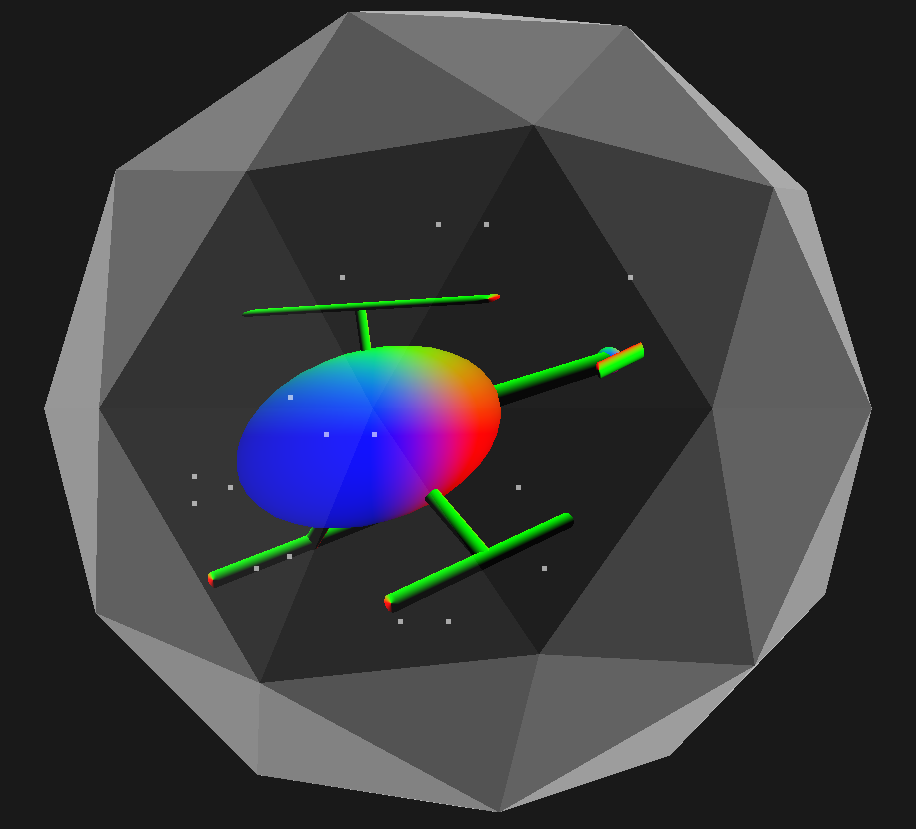

Helicopter Animation
===================

This OpenGL program shows an animated helicopter in a snowglobe, that can be spun around using the keyboard

Build Instructions (Windows)
------------

Download visual studio: https://visualstudio.microsoft.com/  
Download the OpenGL directory from my repository 'OpenGL-Dependency' and put it on your C: drive  
Clone repo and open "program2b.sln" file with visual studio. Build and run.

Controls
--------

Spin the snowglobe using 'a' and 'd' keys
